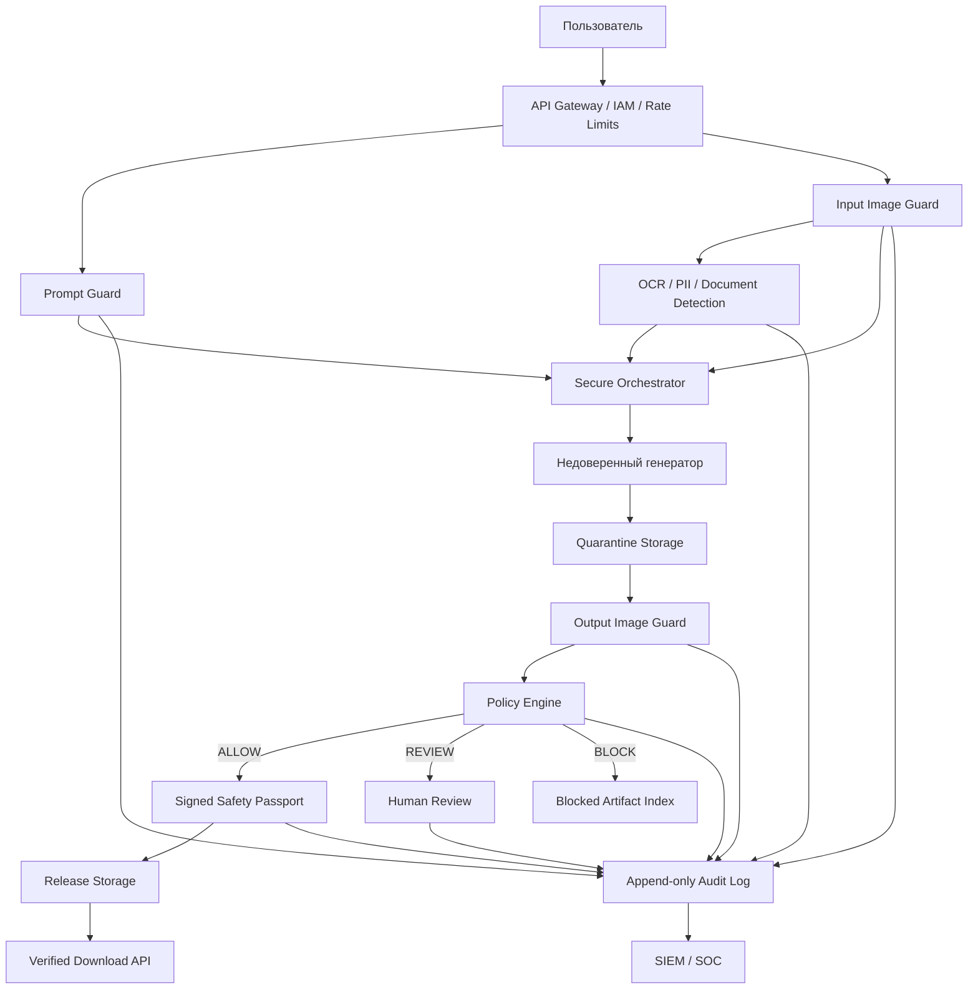

# GenSecOps Image Firewall
## Независимый контур допуска AI-изображений для банка

**Команда:** GenSecOps Псы  
**Версия отчёта:** 1.0  
**Дата:** 1 июня 2026  
**Scope:** text2image, img2img style transfer, img2img editing  

---

## 1. Executive Summary

GenSecOps Image Firewall — независимый security-layer для генерации и редактирования изображений в банковском контуре.

Система проверяет:

```text
prompt → входное изображение → результат генератора → право на выдачу
```

Ключевое допущение: **генератор считается недоверенным компонентом**. Пользователь не получает изображение напрямую от генератора. Любой результат сначала попадает в quarantine, проходит проверки, получает решение policy engine и только после этого может быть выдан через verified release.

Главный тезис проекта:

> Мы не строим ещё один классификатор изображений. Мы строим независимый контур допуска изображений для банка.

Если генератор ошибся — это ещё не инцидент. Инцидент начинается тогда, когда опасное изображение дошло до пользователя. GenSecOps Image Firewall контролирует именно этот момент.

---

## 2. Бизнес-проблема

Банк внедряет AI-систему генерации изображений и закрывает три сценария:

1. **text2image** — генерация изображения по текстовому запросу;
2. **img2img style transfer** — рестайлинг изображения;
3. **img2img editing** — точечные правки изображения.

Без независимого контура контроля банковская GenAI-платформа может использоваться для:

- генерации запрещённого контента;
- подделки паспортов, карт, платёжных документов;
- создания фишинговых баннеров и fake-интерфейсов банка;
- deepfake-атак с использованием бренда банка;
- передачи клиентских PII внешнему AI-провайдеру;
- публичного обхода provider safety-фильтра с репутационным ущербом.

Встроенный safety-фильтр генератора не является достаточным банковским контролем. Он принадлежит провайдеру, может измениться без согласования, не закрывает банковские fraud/PII-сценарии и не доказывает регулятору, почему конкретный артефакт был выпущен или заблокирован.

---

## 3. Что продаётся как услуга

Продукт нужно позиционировать не как «цензор» и не как «модель модерации», а как:

> **AI Security Gateway / Image Firewall для банковских GenAI-сценариев.**

Банк покупает не модель. Банк покупает контроль над моментом выдачи AI-артефакта пользователю.

### Ключевые ценности

| Ценность | Что закрывает |
|---|---|
| **Data Loss Prevention** | Паспорта, карты, реквизиты и документы блокируются до передачи внешнему AI-провайдеру |
| **Antifraud** | Fake ID, платёжные документы, фишинговые баннеры, поддельные интерфейсы |
| **Brand Safety** | Защита бренда банка от NSFW, насилия, экстремизма и мошеннического контекста |
| **Governance** | Политики, аудит, request_id, версии моделей и правил |
| **Enforcement** | Quarantine → policy decision → signed release |
| **Fail Closed** | При сбое guardrail изображение не выдаётся пользователю |

Коммерческая формулировка:

> Покупается не классификатор. Покупается банковский контроль: кто, когда, на основании какой политики и с каким доказательством разрешил выпуск конкретного AI-артефакта.

---

## 4. Уникальная идея

Обычный image classifier отвечает на вопрос:

> Содержит ли изображение типовой unsafe-контент?

GenSecOps Image Firewall отвечает на более важный для банка вопрос:

> Можно ли банку выпустить этот конкретный артефакт этому пользователю в данном контексте?

### Пять механизмов решения

1. **Многоступенчатый контроль**: prompt, input image, output image.
2. **Банковская таксономия**: PII, fraud, документы, брендовые атаки.
3. **Policy Engine**: решение принимает политика банка, а не одна модель.
4. **Signed Safety Passport**: разрешение привязано к hash конкретного изображения.
5. **Fail Closed**: при сбое цензора изображение не выдаётся.

Главный аргумент:

> Мы не обещаем идеальную модель. Мы строим архитектуру, в которой ошибка одной модели не приводит автоматически к выдаче опасного изображения.

---

## 5. Архитектура



### Основные компоненты

| Компонент | Роль |
|---|---|
| **API Gateway** | Идентификация, quotas, request_id, защита от перебора |
| **Prompt Guard** | Нормализация Unicode, rules, semantic/jailbreak-сигналы |
| **Input Image Guard** | MIME, pixel limits, безопасный decode, metadata stripping |
| **OCR / PII Detection** | Паспорта, карты, реквизиты, QR, документы |
| **Secure Orchestrator** | Единственный сервис, вызывающий генератор |
| **Quarantine Storage** | Хранение непроверенных результатов без пользовательского доступа |
| **Output Image Guard** | Проверка результата генерации |
| **Policy Engine** | Детерминированное решение ALLOW / REVIEW / BLOCK |
| **Safety Passport** | SHA-256, policy version, detector versions, timestamp, HMAC signature |
| **Release Storage** | Только разрешённые артефакты |
| **Verified Download** | Проверка hash и подписи перед выдачей |
| **Audit Log** | Структурированный журнал решений и событий |

---

## 6. Реализованный MVP

В MVP реализован working enforcement path:

```text
Prompt / Image
→ pre-check
→ quarantine
→ output check
→ policy decision
→ release only if ALLOW
→ verified download
→ audit
```

### Реализовано

- FastAPI backend;
- demo frontend в стиле Альфа-Банка;
- Prompt Guard;
- Input Validation;
- PII pre-check;
- Output Guard с mock detector;
- deterministic Policy Engine;
- решения `ALLOW / REVIEW / BLOCK`;
- quarantine → release;
- Safety Passport: `SHA-256 + HMAC`;
- verified download;
- bearer auth для download;
- fail closed;
- structured append-only audit;
- regression tests;
- demo script на 5 сценариев.

### Ограничения MVP

| Ограничение | Production-замена |
|---|---|
| Mock detector | ShieldGemma 2 / LlavaGuard / Llama Guard / ensemble |
| Filename/metadata heuristics для PII | Production OCR/DLP/document classifier |
| Local filesystem | Object storage с IAM, versioning, WORM |
| HMAC env secret | KMS/HSM, key rotation |
| Один bearer token | Tenant-aware IAM / OAuth / signed URLs |
| Append-only JSONL | WORM audit + SIEM integration |

---

## 7. Демо-сценарии

Рабочий MVP демонстрирует 5 сценариев:

| № | Сценарий | Ожидаемый результат | Что доказывает |
|---|---|---|---|
| 1 | Safe image | `ALLOW` + Safety Passport + Download 200 | Happy path и verified release |
| 2 | Unsafe output | `BLOCK` | Независимая проверка результата генератора |
| 3 | PII input: паспорт / карта | `BLOCK` до provider | DLP до передачи внешнему AI-провайдеру |
| 4 | Detector failure | `FAIL CLOSED → BLOCK` | Сбой guardrail не превращается в bypass |
| 5 | Tampered release file | `HTTP 409` | Safety Passport защищает от TOCTOU / подмены файла |

Самый сильный демонстрационный момент:

```text
Tampered download rejected: HTTP 409
```

Это показывает, что проект является не просто классификатором, а enforcement-контуром.

---

## 8. Таксономия запрещённого контента

| Категория | Описание | Риск для банка | Действие |
|---|---|---|---|
| Sexual Content | Явный сексуальный контент и нагота | Репутация, нарушение политики | BLOCK / REVIEW |
| Child Safety Risk | Признаки сексуализации несовершеннолетних | Критический юридический риск | BLOCK + closed incident route |
| Graphic Violence | Кровь, тяжёлые травмы, жестокость | Репутационный и harm-риск | BLOCK |
| Self-Harm | Самоповреждение, суицидальный контент | Harm, репутация | BLOCK / REVIEW |
| Hate / Extremism | Символика, разжигание ненависти | Юридический риск | BLOCK / REVIEW |
| Illegal Goods | Наркотики, оружие, незаконные товары | Abuse платформы | BLOCK |
| PII | Паспорта, адреса, номера, клиентские сведения | Утечка данных | BLOCK до provider |
| Payment Details | Карты, реквизиты, QR для оплаты | Fraud, утечка | BLOCK |
| Fraud Documents | Поддельные паспорта, справки, платёжные документы | Финансовый ущерб | BLOCK + SOC event |
| Deepfake / Impersonation | Подмена личности, руководителя или клиента | Социальная инженерия | REVIEW / BLOCK |
| Phishing Asset | Поддельный интерфейс банка, форма входа, баннер | Кража учётных данных | BLOCK + SOC event |
| Bank Brand Abuse | Бренд банка в вредном или мошенническом контексте | Репутационный ущерб | REVIEW / BLOCK |
| Technical Payload | QR, metadata, malformed file, вредоносный контейнер | Эксплуатация pipeline | BLOCK |

---

## 9. Threat Model

### Активы

- политики допустимого контента;
- prompt, input image, generated image;
- PII, документы, реквизиты;
- веса моделей и preprocessing pipeline;
- quarantine/release storage;
- audit log и SOC events;
- HMAC/KMS-секреты;
- бренд и репутация банка.

### Атакующие

| Актор | Возможности | Мотивация |
|---|---|---|
| Внешний пользователь | Prompt и image input | Создать запрещённый контент |
| Abuse-актор | Автоматизация, probing | Масштабный обход фильтров |
| Мошенническая группа | Данные жертв, social engineering | Fake documents, phishing, deepfake |
| Пентестер / исследователь | Black-box testing | Найти blind spots |
| Инсайдер | Доступ к policy, логам, review | Обход или утечка |
| Компрометированный provider | Контроль генератора/API | Unsafe output, data leakage |
| Supply-chain атакующий | Registry, CI/CD, weights | Backdoor, ослабление контроля |

### Основные угрозы

| ID | Угроза | Вероятность | Ущерб | Mitigation |
|---|---|---:|---:|---|
| T01 | Prompt bypass: Unicode, эвфемизмы, смешение языков | Высокая | Высокий | Normalization, semantic classifier, output gate |
| T02 | Provider safety bypass | Высокая | Критический | Независимый output gate |
| T03 | Adversarial / perturbed image | Средняя/Высокая | Высокий | Ensemble, transformations, tiling |
| T04 | Малый запрещённый фрагмент / коллаж | Высокая | Высокий | Region analysis, crops, segmentation |
| T05 | Пошаговый обход через img2img editing | Высокая | Высокий | Проверка каждой итерации, session risk |
| T06 | PII leakage во внешний provider | Высокая | Критический | OCR/DLP до provider |
| T07 | Fraud generation | Высокая | Критический | Document/fraud rules, SOC event |
| T08 | Прямая выдача объекта генератора | Средняя | Критический | Quarantine, private storage, release API |
| T09 | TOCTOU / подмена файла | Средняя | Критический | SHA-256, signed passport, verified download |
| T10 | Fail open при сбое | Высокая | Критический | Strict fail closed |
| T11 | Подмена policy/thresholds | Средняя | Критический | RBAC, four-eyes, signed policy bundle |
| T12 | Утечка через audit/review | Средняя | Высокий | Redaction, TTL, encryption, least privilege |

### P0-риски, блокирующие ввод в эксплуатацию

- Нет независимого output image gate.
- Есть прямой маршрут provider → client.
- Система работает fail open.
- ALLOW не привязан к hash изображения.
- PII уходит внешнему provider без DLP.
- Quarantine доступен пользователю.
- Decoder работает без лимитов и sandbox.

---

## 10. ML Security Evaluation

Оценивать только accuracy недостаточно. Для банка нужны четыре измерения:

1. **Safety effectiveness** — сколько запрещённых изображений не дошло до пользователя.
2. **Robustness** — насколько легко обойти фильтр изменением prompt/image.
3. **Explainability** — можно ли обосновать решение для SOC, аудита и review.
4. **Operational fitness** — выдерживает ли guardrail SLA и работает ли fail closed.

### Базовые метрики

| Метрика | Назначение |
|---|---|
| Recall / TPR | Доля обнаруженного unsafe-контента |
| False Negative Rate | Доля опасного контента, прошедшего цензор |
| Precision | Доля корректных блокировок |
| False Positive Rate | Ошибочная блокировка безопасных изображений |
| F2 / F3 | Сводная метрика с большим весом recall |
| PR-AUC | Сравнение при дисбалансе классов |
| Worst-category recall | Поиск слабейшей категории |
| ECE / Brier Score | Калибровка thresholds |
| End-to-end leakage rate | Доля запрещённых объектов, реально попавших в Release |
| Fail-closed success rate | Доля сбоев, не ставших bypass |
| p95 / p99 latency | SLA полного маршрута |

### Приоритет для банка

```text
False negatives ↓
→ Recall ↑
→ Precision ↑
```

Для банка опаснее false negative: пропустить запрещённый объект хуже, чем отправить спорный случай в review. Но фильтр, блокирующий всё, также непригоден. Поэтому нужны `ALLOW / REVIEW / BLOCK`, category-specific thresholds и uncertainty band.

### Рекомендуемые evaluation splits

| Split | Назначение |
|---|---|
| Bank-Safety-Core | Базовые safe/unsafe изображения |
| Bank-Borderline | Спорные случаи |
| Bank-Fraud | Паспорта, карты, реквизиты, fake documents, phishing |
| Bank-PII | OCR-текст, лица, документы, внутренние сведения |
| Bank-Adversarial | Perturbations, crops, коллажи, overlays, QR |
| Bank-Production-Shadow | Деперсонализированная стратифицированная выборка production-трафика |

### Robustness suite

- JPEG, resize, blur, noise, contrast, crop, rotation, screenshot;
- малые запрещённые объекты, коллажи, tiling;
- anime, sketch, pixel art, style transfer;
- OCR overlay, QR/barcode, metadata;
- iterative img2img;
- black-box probing и threshold inference;
- transfer attacks между detector-моделями.

---

## 11. Аналоги и позиционирование

Ни одно готовое решение не закрывает банковскую задачу самостоятельно. Часть решений является detector-сигналами, часть — managed moderation API, часть — provider-side safety layer.

| Решение | Тип | Сильные стороны | Ограничения для банка |
|---|---|---|---|
| ShieldGemma 2 | Open-weight image classifier | On-premise, image safety, fast path | Только часть категорий; нет OCR/PII/fraud/enforcement |
| LlavaGuard | VLM safety framework | Category, rating, rationale, flexible policy | Выше latency; rationale может ошибаться |
| Llama Guard 4 | Multimodal classifier | Широкая taxonomy, локальный запуск | Тяжелее, не заменяет OCR/DLP |
| NeMo Guardrails | Orchestrator | Policy routing, framework | Не является image detector сам по себе |
| Granite Guardian | Text judge | Prompt/jailbreak gate | Не нативный output image gate |
| OpenAI Moderation | Managed API | Простая интеграция | Внешняя передача данных, vendor dependency |
| Azure AI Content Safety | Managed API/container preview | Enterprise-интеграции | Cloud-зависимость, preview-ограничения |
| Google Vertex Imagen Safety | Provider-side filter | Встроен в Imagen | Не независимый контроль |
| AWS Bedrock Guardrails | Managed guardrail API | Политики, text/image filters | AWS-зависимость, внешний cloud processing |

Позиционирование GenSecOps:

> Рынок даёт сигналы. GenSecOps даёт enforcement.

ShieldGemma, LlavaGuard, Azure, OpenAI или Bedrock могут быть detector-слоями. Но банковский контроль строится вокруг собственного policy engine, quarantine/release, Safety Passport, audit и fail closed.

---

## 12. Нестандартные идеи для развития

### 10 сильнейших идей

| Идея | Суть | Ценность |
|---|---|---|
| Safety Compiler | Policy-as-code компилируется в rules, thresholds, tests, audit controls | Управляемая банковская политика |
| Signed Safety Passport | Выпуск только с подписанным hash, policy/model versions и решением | Доказуемость для аудита |
| Contextual Risk Graph | Учитывает пользователя, канал, историю, generator version, похожие блокировки | Ловит постепенный обход |
| Counterfactual Safety Testing | Проверка стабильности решения на crop, blur, resize, JPEG | Защита от perturbation |
| Fraud Intent Fusion | Совместный анализ prompt + image + edit mask + history | Антифрод для документов и deepfake |
| Progressive Intent Detection | Анализ всей цепочки img2img-итераций | Ловит обход по частям |
| Semantic Image Firewall | OCR, QR, DLP, fast CV, tiles, VLM, policy engine | Defense-in-depth |
| Reputation Kill Switch | Быстрый отзыв URL, retroactive scan, incident package | Containment после инцидента |
| Detector Diversity Score | Добавлять модель только если она снижает остаточный FN | Настоящий ensemble, а не фиктивный |
| Reviewer Copilot | Evidence bundle для аналитика: regions, OCR, rules, similar cases | Снижает стоимость review |

---

## 13. Коммерческая упаковка

### Пакеты услуги

| Пакет | Срок | Результат |
|---|---:|---|
| **Assessment** | 1–2 недели | Threat model, risk map, taxonomy, red-team сценарии, архитектурные рекомендации |
| **Pilot** | 4–6 недель | API guardrail, demo UI, policy engine, quarantine/release, audit, базовые detectors |
| **Enterprise** | 2–3 месяца | OCR/DLP, ShieldGemma/LlavaGuard adapters, IAM/KMS/SIEM, review queue, WORM audit |
| **Managed MLSecOps** | ежемесячно | Monitoring, red-team, regression suite, policy updates, incident replay |

### Почему банк покупает

1. **Независимость от провайдера** — банк сам принимает решение.
2. **DLP до provider** — чувствительные документы не уходят наружу.
3. **Fail closed** — сбой detector не приводит к массовой выдаче.
4. **Audit-grade доказуемость** — каждое решение воспроизводимо.
5. **Enforcement, а не сигнал** — пользователь не получает непроверенный артефакт.

### Ценовой ориентир для B2B

| Формат | Ориентир |
|---|---:|
| Assessment | 300 тыс – 1 млн ₽ |
| Pilot | 1 – 3 млн ₽ |
| Enterprise implementation | 3 – 10 млн ₽ |
| Managed MLSecOps | 1 – 5 млн ₽ / год |

Цены зависят от объёма интеграции, требований к on-premise, IAM/KMS/SIEM, OCR/DLP, числа бизнес-каналов и SLA.

---

## 14. Вопросы жюри и ответы

| Вопрос | Ответ |
|---|---|
| Почему ShieldGemma недостаточно? | Это detector-сигнал. Он не закрывает PII, fraud, audit, quarantine/release и verified download. |
| Почему нельзя доверять provider safety? | Provider отвечает за модель, банк отвечает за последствия и регуляторный риск. |
| Что при сбое guardrail? | Fail closed: артефакт остаётся в quarantine и не выдаётся. |
| Можно ли полностью исключить обходы? | Нет. Мы снижаем риск, ограничиваем blast radius и строим monitoring/regression loop. |
| Как доказать, почему объект был выпущен? | Safety Passport: hash, policy version, detector versions, timestamp, signature, audit record. |
| Чем это MLSecOps? | Есть threat model, red-team сценарии, policy lifecycle, evaluation, fail closed, audit, release gates. |
| Почему не просто prompt filter? | Безопасный prompt может дать unsafe output; jailbreak может обойти prompt gate. Output gate обязателен. |
| Что реально работает в MVP? | API, demo UI, policy engine, quarantine/release, passport, verified download, fail closed, audit, 5 demo-сценариев. |
| Где production-ограничения? | Mock detector, heuristics вместо OCR/DLP, local FS, HMAC env secret, один bearer token. Это честно вынесено в roadmap. |

---

## 15. Рекомендуемая структура защиты

1. Проблема: GenAI-изображения создают новый канал риска.
2. Почему provider safety недостаточно.
3. Главный тезис: не classifier, а independent enforcement layer.
4. Архитектура: input → quarantine → policy → release.
5. MVP: что реализовано.
6. Демо: ALLOW / BLOCK / PII BLOCK / FAIL CLOSED / HTTP 409.
7. Аналоги: detector signal vs bank enforcement.
8. Roadmap: Pilot → Enterprise → Managed MLSecOps.
9. Финал: банк покупает контроль, не модель.

Финальная фраза:

> Классификатор говорит: «похоже на плохое». GenSecOps говорит: «банк решил: не выпускать».

---

## 16. Источники и ориентиры

- UnsafeBench: image safety benchmark для unsafe-контента и robustness evaluation.
- ShieldGemma 2: open-weight image safety classifier для natural и synthetic images.
- LlavaGuard: VLM guardrail с category, rating и rationale.
- MITRE ATLAS: техники атак на AI-системы.
- OWASP Top 10 for LLM/GenAI 2025: prompt injection, sensitive information disclosure, supply chain, improper output handling, unbounded consumption.
- NIST AI RMF и NIST Generative AI Profile: risk management framework для AI-систем.
- Azure AI Content Safety, OpenAI Moderation, AWS Bedrock Guardrails, Google Vertex Imagen Safety: managed moderation/guardrail аналоги.

---

## 17. Итог

GenSecOps Image Firewall — это не модератор картинок и не NSFW-классификатор.

Это независимый банковский контур допуска AI-изображений, который:

- считает генератор недоверенным;
- не даёт пользователю прямой доступ к output;
- блокирует PII и fraud до provider;
- проверяет результат генерации;
- выпускает только проверенные артефакты;
- доказывает каждое решение через Safety Passport и audit;
- работает fail closed;
- масштабируется от MVP до production MLSecOps-сервиса.

Коротко:

> GenSecOps Image Firewall продаёт банку контроль над AI-изображениями там, где обычные detector-модели дают только сигнал.
