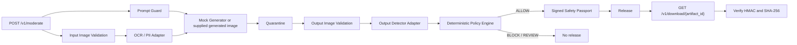

# Architecture

## Enforcement path

## Decisions

- The generator is untrusted.
- Generated bytes are quarantined before output moderation.
- The inspected output is normalized to PNG with metadata removed.
- Only `ALLOW` creates a release file and passport.
- Download requires a demo bearer token and verifies passport HMAC, artifact
  binding, and artifact hash.
- Security adapter failures become `BLOCK` decisions.
- A moderation decision is appended to audit before atomic promotion.

## Components

| Component | MVP implementation | Production replacement |
|---|---|---|
| Prompt Guard | NFKC normalization and explainable rules | Multilingual classifier and versioned rules |
| Input Validator | Pillow safe decode, format, bytes and pixel limits | Sandboxed decoder and malware scan |
| OCR / PII | Filename and metadata heuristics | Sandboxed OCR, document and QR detectors |
| Output Guard | Deterministic mock adapter | Validated ShieldGemma or other detector adapter |
| Storage | Local directories | Private object storage with IAM and TTL |
| Passport | Environment-provided HMAC-SHA256 secret | KMS/HSM-backed signatures and key rotation |
| Audit | Append-only JSONL | WORM sink and SIEM forwarding |

## Output detector adapter

`app.guards.output_guard.OutputDetector` is the integration contract. A future
ShieldGemma adapter must be evaluated separately and fail closed on timeout,
model loading failure, malformed output, and inference errors.
